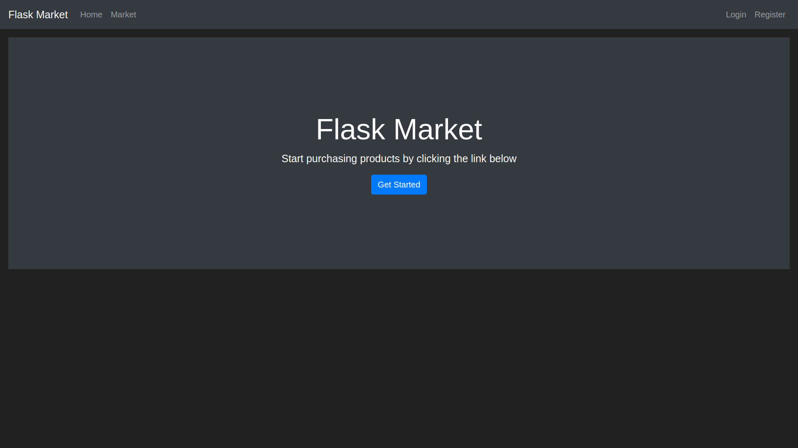
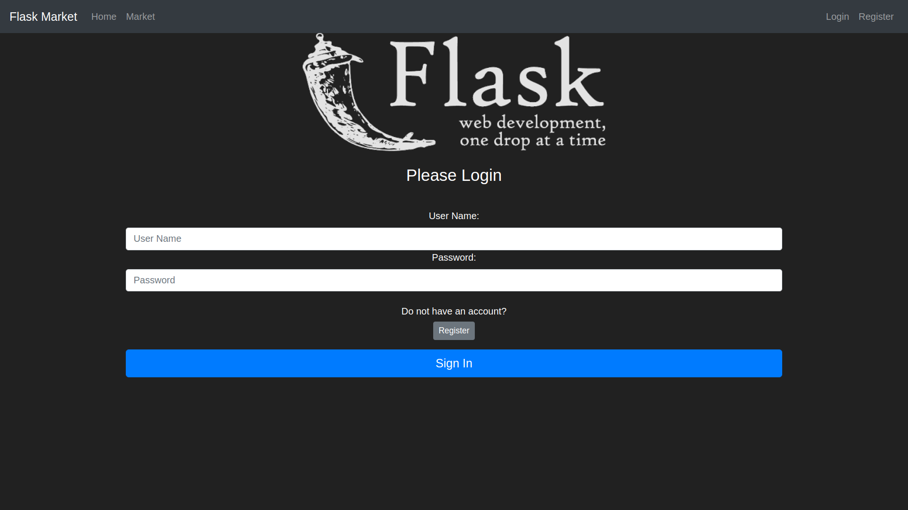
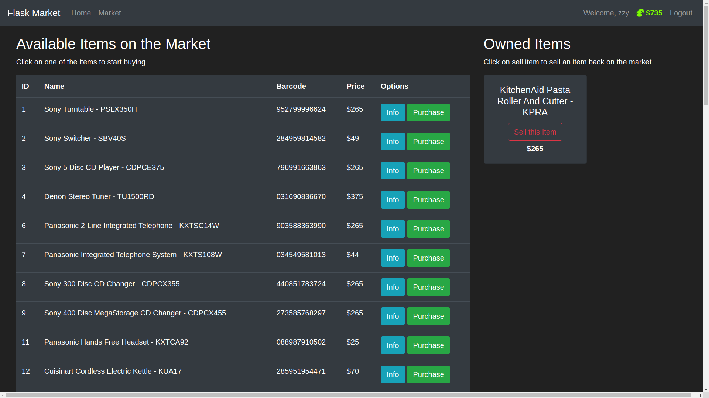
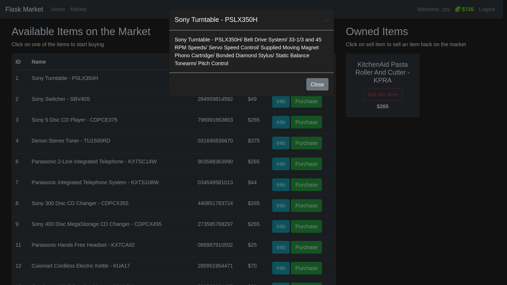
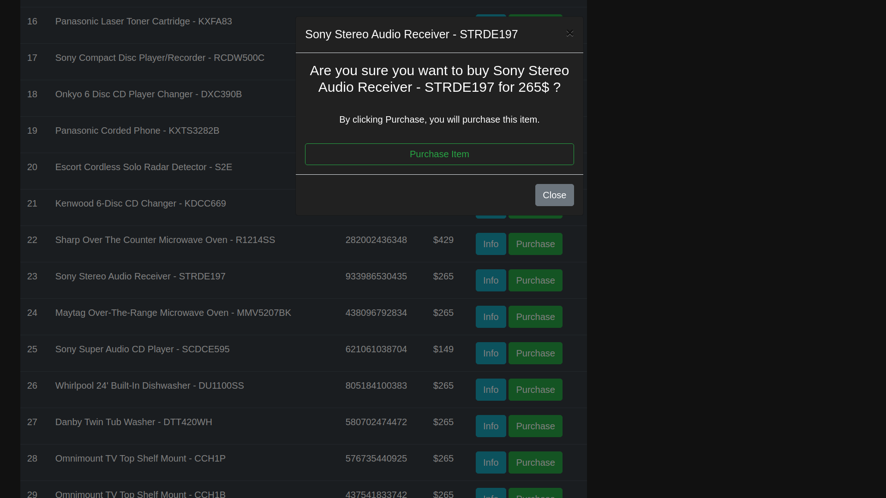
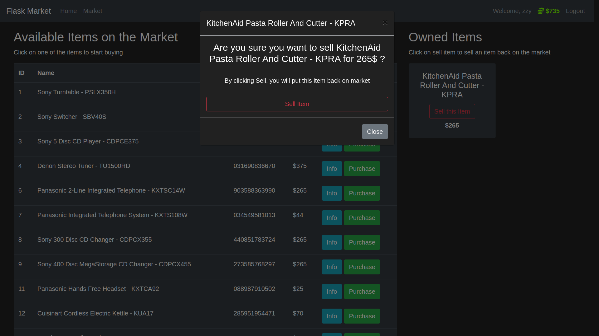

# flask-market

A market for buying and selling electronic products built with Bootstrap, Jinja, Flask and SQLite.

To download dataset and create a sqlite db file:

`python create_db.py`

To start the application:

`python run.py`

and go to [http://localhost:5000](http://localhost:5000)

# Preview

Home Page:

Login Page:

Market Page:

Product Info:

Purchase item:

Sell item:

